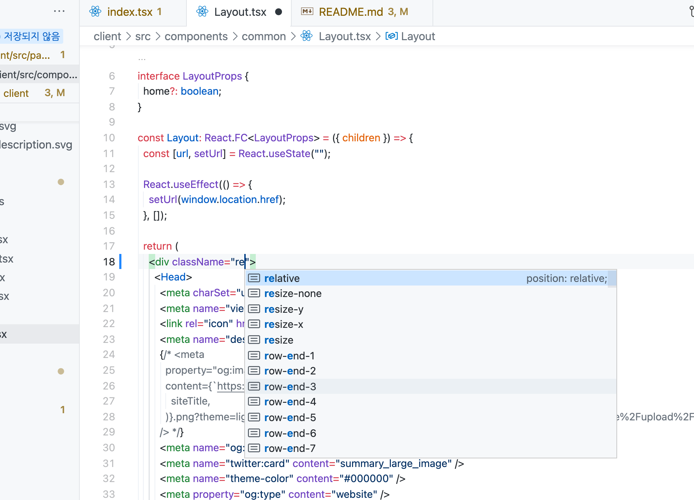
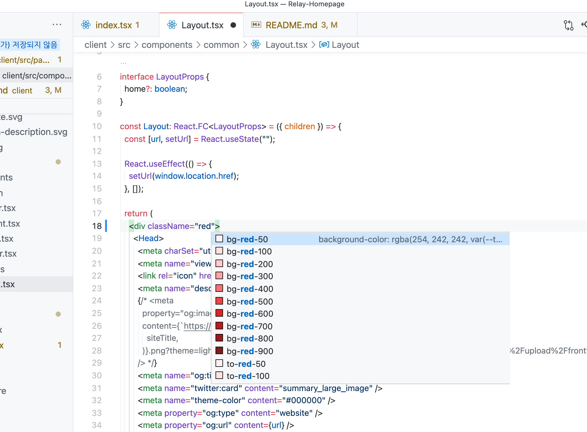

# Relay Homepage Client Guide

### dev

27285 포트 사용
http://localhost:27285 로 접속 가능

```sh
yarn dev
```

#### component - src/components

- 컴포넌트 단위의 UI

#### page - src/pages

- 컨테이너 단위의 UI 집합

#### typescript

- javascript 문법으로 사용해도 warning만 나오기 때문에 파일 이름만 ts, tsx로 지정 후 js 문법만 사용하는 형태도 가능

#### Notice

.eslintrc.js, postcss.config.js, tailwind.config.js에 나오는 Parsing error: "parserOptions.project" has been set for @typescript-eslint/parser 에러는 에디터 버그임 신경 꺼도됨

#### Styling

tailwindcss에서 제공하는 디자인 가이드를 따름. => 사용을 위해서 [vscode 확장 프로그램 중 tailwindcss IntelliSense](https://marketplace.visualstudio.com/items?itemName=bradlc.vscode-tailwindcss)를 설치하고 컴포넌트 className를 입력하려고 하면 추천받을 수 있음.




-> 참고로 주희님이 만든 css는 그대로 둠

### deploy

[이거](https://falsy.me/%EC%83%88%EB%A1%9C%EC%9A%B4-%EB%B2%84%EC%A0%84-serverless-framework%EB%A5%BC-%EC%82%AC%EC%9A%A9%ED%95%98%EC%97%AC-nextjs-%ED%94%84%EB%A1%9C%EC%A0%9D%ED%8A%B8%EB%A5%BC-aws-lambda%EB%A5%BC-%ED%86%B5/)를 참고하시면 됨